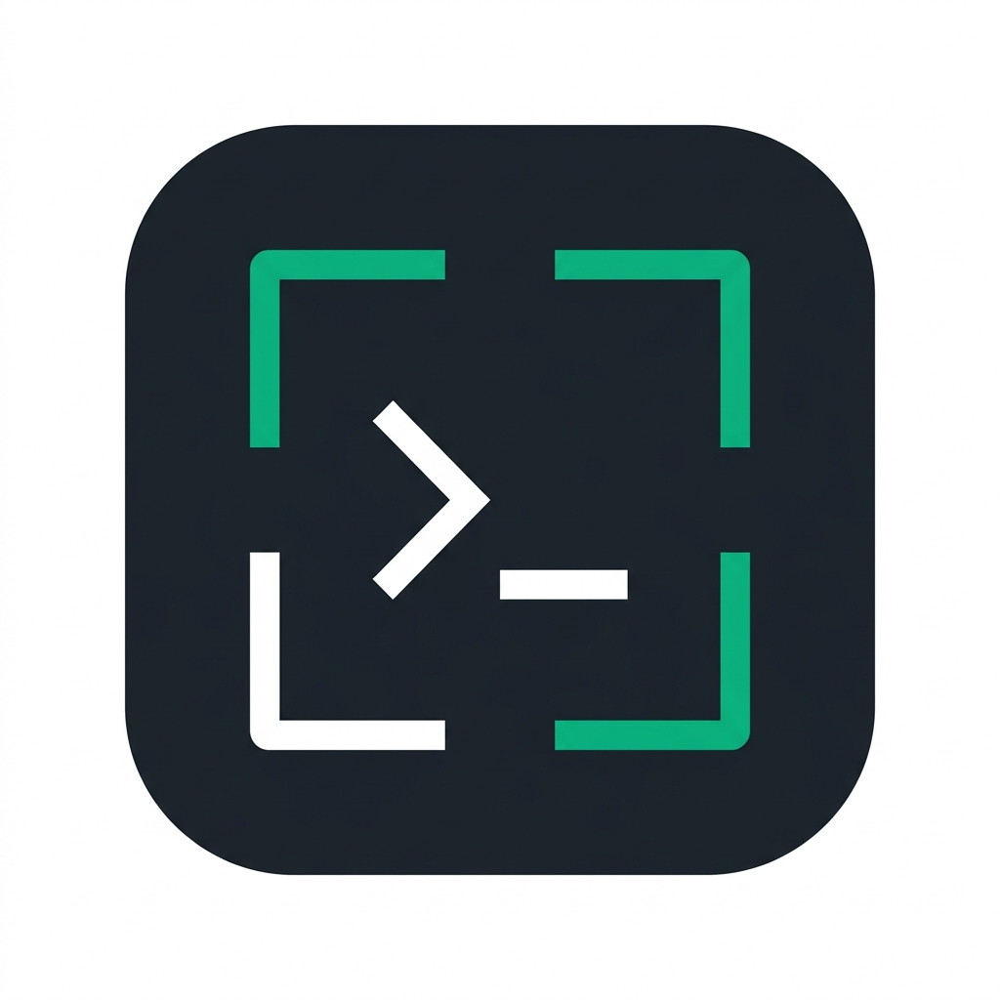
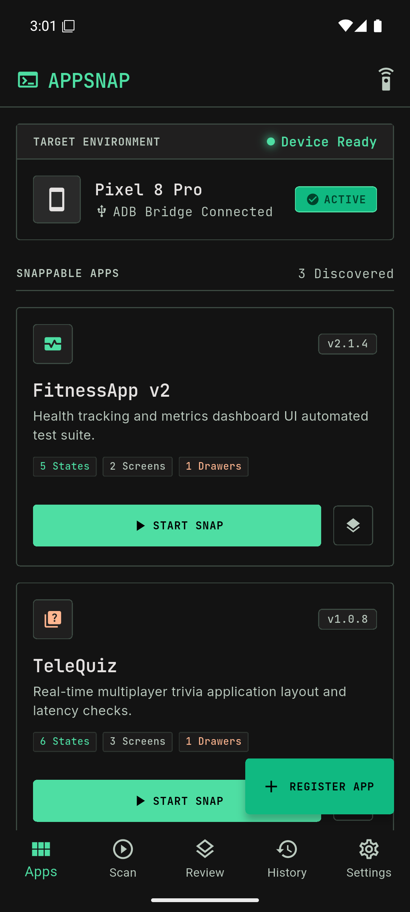
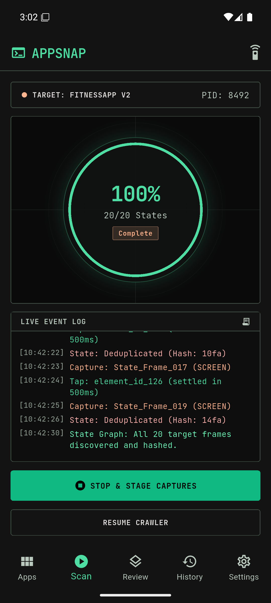
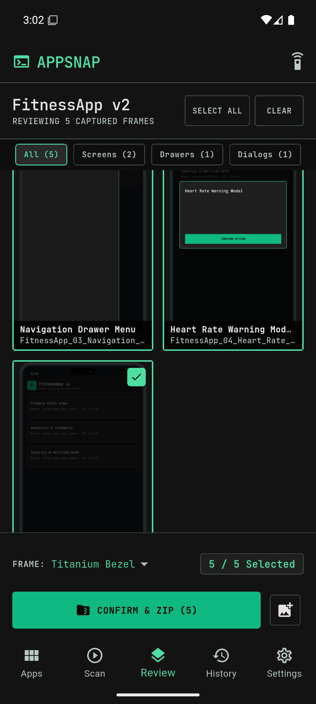
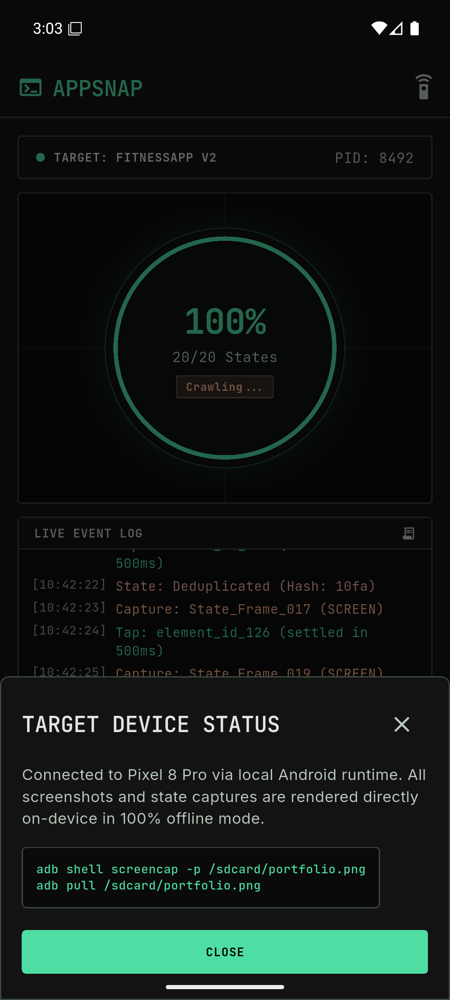
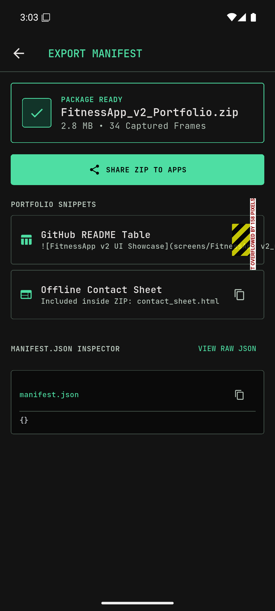

# 📸 AppSnap (v2.0.0) — Release Documentation & Showcase

**Native Android Screenshot Studio & Automated Portfolio Package Generator**

---

## 📱 Application Screenshots

  <table>
    <tr>
      <td align="center" width="20%">
         
        <b>Apps Dashboard</b> 
        <i>Real phone apps, search & filters</i>
      </td>
      <td align="center" width="20%">
         
        <b>Active Scanner</b> 
        <i>State crawler & progress ring</i>
      </td>
      <td align="center" width="20%">
         
        <b>Screen Stager</b> 
        <i>Mockup frames & canvas preview</i>
      </td>
      <td align="center" width="20%">
         
        <b>Manifest Viewer</b> 
        <i>JSON export & ZIP share sheet</i>
      </td>
      <td align="center" width="20%">
         
        <b>Appearance</b> 
        <i>Theme modes & local settings</i>
      </td>
    </tr>
  </table>

---

## 📦 Release Information

- **App ID:** `appsnap`
- **Release Version:** `v2.0.0`
- **Platform:** Android 8.0+ (API 26+)
- **Binary:** [`v2.0.0/appsnap-v2.0.0.apk`](v2.0.0/appsnap-v2.0.0.apk) *(51.1 MB)*
- **SHA-256 Checksum:** `097e519862c4fc5af30094463c5bcb5a0bc8c54e2f878135c6846f16261ff5ef`

---

## 📋 Release Highlights

1. **Native Android Discovery:** Queries real installed applications using native `PackageManager` and extracts app icons directly.
2. **1-Click Auto-Portfolio Generator:** Synthesizes complete 5-state vector UI sets for any app.
3. **Device Screenshot Sync:** Real-time sync of screenshots taken on the phone via `MediaStore`.
4. **5 Mockup Frame Styles:** Titanium Bezel, Clay Minimal, Portfolio Card, Studio Dark, and Raw Screen.
5. **Clean 9:41 AM Demo Status Bar:** Universal clean demo status bar replacement engine.
6. **Self-Contained ZIP Packaging:** Bundles `manifest.json`, responsive `contact_sheet.html`, and framed PNGs.
7. **Technical Minimalism Light/Dark Design:** Modern typography, high-contrast controls, and custom vector viewfinder+terminal navigation icon.
