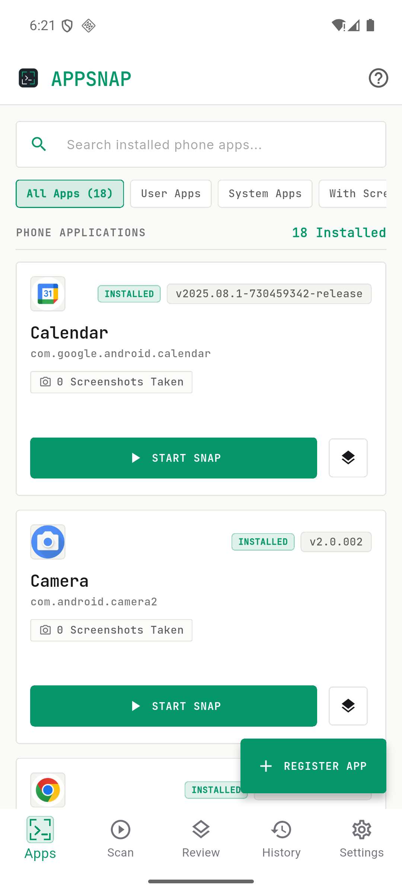
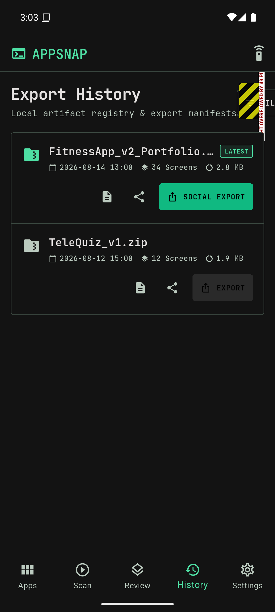
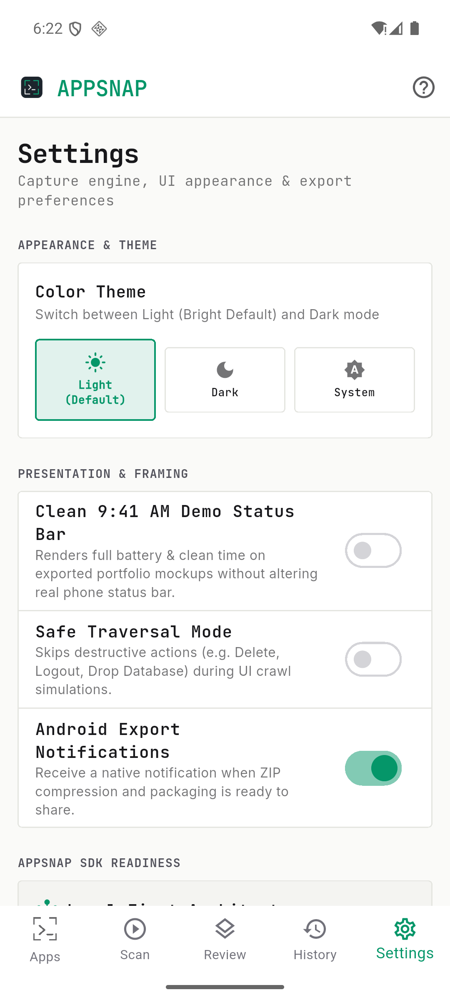

# 📸 AppSnap (v2.1.0) — Release Documentation & Showcase

**Native Android Screenshot Studio & Automated Portfolio Package Generator**

---

## 📱 Application Screenshots

  <table>
    <tr>
      <td align="center" width="16%">
         
        <b>Apps Dashboard</b> 
        <i>Real phone apps, search & quick snap</i>
      </td>
      <td align="center" width="16%">
         
        <b>Live Capture</b> 
        <i>Floating shutter & gallery intake</i>
      </td>
      <td align="center" width="16%">
         
        <b>Screen Stager</b> 
        <i>Mockup frames & quick reject</i>
      </td>
      <td align="center" width="16%">
         
        <b>Export & Save</b> 
        <i>Save to device & social sharing</i>
      </td>
      <td align="center" width="16%">
         
        <b>Export History</b> 
        <i>Artifact registry & ZIP access</i>
      </td>
      <td align="center" width="16%">
         
        <b>Settings</b> 
        <i>Theme modes & storage info</i>
      </td>
    </tr>
  </table>

---

## 📦 Release Downloads & Information

- **App ID:** `appsnap`
- **Release Version:** `v2.1.0`
- **Platform:** Android 8.0+ (API 26+)

| Architecture | File | Size | SHA-256 Checksum |
| :--- | :--- | :--- | :--- |
| **ARM64 (Modern Phones)** | [`v2.1.0/appsnap-v2.1.0-arm64-v8a.apk`](v2.1.0/appsnap-v2.1.0-arm64-v8a.apk) | **20.5 MB** | `25968c450d6c3aa36cf0d8ad18f0e41cd6c0ad0c2d48e5bd16535bb8993c08a2` |
| **ARMv7 (Older 32-bit Phones)** | [`v2.1.0/appsnap-v2.1.0-armeabi-v7a.apk`](v2.1.0/appsnap-v2.1.0-armeabi-v7a.apk) | **17.9 MB** | `db24cb992de3867b24db00055b2331954561060d3a028c79a178b08d14814483` |
| **Universal Release** | [`v2.1.0/appsnap-v2.1.0.apk`](v2.1.0/appsnap-v2.1.0.apk) | **20.5 MB** | `25968c450d6c3aa36cf0d8ad18f0e41cd6c0ad0c2d48e5bd16535bb8993c08a2` |

---

## 📋 Release Highlights (v2.1.0)

1. **Rich Mobile Mockup Frames:** Choose from **Raw Original (Default As-Is)**, **iPhone Titanium (Dynamic Island)**, **Google Pixel Pro (Centered Punch-hole)**, **Clay Minimalist**, **Studio Onyx Dark**, **Portfolio Presentation Card**, and **Midnight Cyber Tech Frame**.
2. **Quick Reject & Drop Controls:** 1-tap "✖" reject button on cards and "DROP / CLEAR ALL" buttons on scan and review screens to easily purge unwanted takes.
3. **Optimized Splash Screen Logo:** Perfectly balanced 80dp splash logo size for crisp native launch.
4. **Native Floating Shutter:** Launches target apps with a floating camera button to capture actual live screens.
5. **Auto-Ghost Shutter:** Floating shutter hides itself for 75ms during captures so it never obscures the final screenshot.
6. **Multi-Image Gallery Import (As-Is):** Add personal device screenshots with 100% original quality preserved.
7. **Interactive Pinch-to-Zoom Preview:** Click any image thumbnail to inspect, rename, or delete.
8. **Save to Device & Social Sharing:** 1-tap direct save for individual images to `Pictures/AppSnap/` and ZIP packages to `Download/AppSnap/`, plus native sharing.
9. **Ultra-Lightweight Minified Build:** 20.5 MB optimized binary via R8 shrinking and ABI splits.
10. **Self-Contained ZIP Packaging:** Bundles `manifest.json`, responsive `contact_sheet.html`, and clean PNGs.
